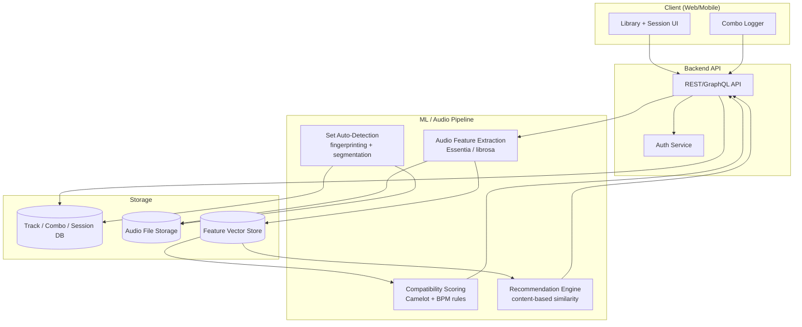
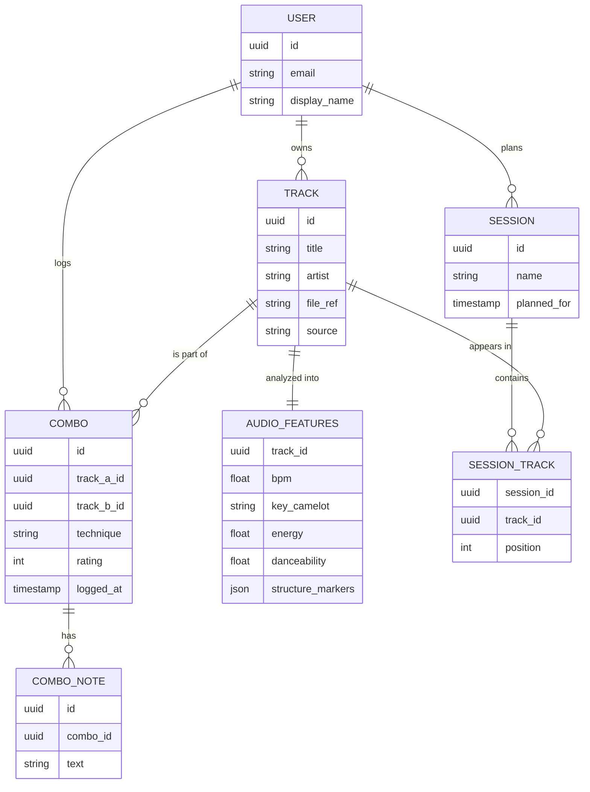

# Xfade — ML-Forward DJ Combo & Transition Logger
### Design Document v0.1

---

## 1. Concept

A free, ML-forward alternative to paid DJ combo-logging apps (e.g. Mixlog). Core promise: log the track combinations and transitions you discover, get smart compatibility scoring and recommendations grounded in real audio analysis (not just manually-tagged metadata), and — eventually — auto-detect combos from a recorded set instead of manual entry.

**Differentiator vs. incumbents:** most existing tools rely on metadata you type in or import from DJ software. Xfade's edge is deriving key/BPM/energy/structure directly from the audio itself, and using that as the foundation for a real recommendation engine rather than a static compatibility chart.

---

## 2. Goals

- A personal tool you'd actually use after real sets (friction-free logging is the #1 make-or-break factor — if logging takes more than a few seconds, it won't get used).
- Real ML underneath, not ML-as-marketing: content-based recommendation grounded in extracted audio features.
- Free/open — no paywall on the core loop.
- Built incrementally: each version should be independently useful, not blocked on the hardest feature.

---

## 3. System Architecture



---

## 4. Data Model



---

## 5. ML / Audio Pipeline Detail

```mermaid
flowchart LR
    A[Raw audio file] --> B[Feature Extraction<br/>BPM, key, energy,<br/>structure markers]
    B --> C[Feature Vector Store]
    C --> D{Use Case}
    D --> E[Rules-based Compatibility<br/>Camelot wheel + tempo match]
    D --> F[Content-based Similarity<br/>cosine sim over feature vectors]
    F --> G[Recommendation:<br/>"tracks that mix well with X"]
    E --> H[Compatibility Score<br/>shown per track pair]
    I[Logged Combos<br/>user feedback loop] -.refines.-> F
```

**Stages, in build order:**

| Version | Capability | Approach |
|---|---|---|
| v1 | Manual combo logging, library, sessions | No ML — CRUD app |
| v1 | Harmonic/BPM compatibility score | Rules engine (Camelot wheel + tempo delta), not ML |
| v2 | "Tracks that mix well with X" recommendations | Content-based similarity over extracted audio features (cosine similarity, or a lightweight learned re-ranker once you have enough logged combos as feedback) |
| v3 | Auto-detect combos from a recorded set | Audio fingerprinting + segmentation to identify track boundaries/transitions automatically |

**Why content-based over collaborative filtering to start:** collaborative filtering ("DJs who mixed A also mixed C") needs a lot of cross-user combo data you won't have early on. Content-based similarity works from day one off a single person's library plus extracted features — much more realistic starting point.

---

## 6. Data Sourcing — the part you asked about

This is the trickiest piece, so worth being specific about what's actually available:

### For your own library (the primary source)
- **You own the audio files** (or have them via a DJ platform), so run extraction locally/server-side yourself — no external dataset needed to get started. This is genuinely the best "training data" you have: your own real tracks.
- **Essentia** (open-source MIR toolkit — <cite index="19-1">the same toolkit Spotify itself used to derive most of its now-deprecated audio feature values</cite>) or **librosa** can extract BPM, key, energy, loudness, and more directly from audio files you provide. This is the core of your pipeline and doesn't depend on any third party staying alive.

### Important: Spotify's audio-features API is dead
<cite index="23-1">Spotify deprecated audio_features, audio_analysis, recommendations, related artists, and featured playlists all at once in November 2024, and there's been no official replacement since.</cite> <cite index="23-1">Apps that had a quota extension already in flight before the cutoff can still use it, but there's no path for a new app to get access, no waitlist, and no indication that will change.</cite> Don't architect around it — build your own extraction pipeline from day one with Essentia/librosa instead, so you're not dependent on a platform that already pulled the rug once.

### If you want a broader dataset beyond your own library (for testing/validating the recommendation model)
- **Free Music Archive (FMA)** — legally free, full audio, commonly used in MIR research, good for validating your extraction pipeline against a larger, varied set before relying on it for your own small library.
- **Million Song Dataset** — huge, but note it's metadata/precomputed features, not raw audio, and the precomputed "Echo Nest" features are old and not directly comparable to Essentia output — useful for structure/scale testing, not for your actual feature pipeline.
- **AcousticBrainz** — community-contributed, Essentia-based feature data; worth checking current status/coverage before relying on it.
- **Your own DJ software exports** — Rekordbox, Serato, and Traktor libraries already store BPM/key metadata you've built up over time (if you've been using one). Exporting that XML/database is a fast way to bootstrap a "ground truth" set to sanity-check your own extraction pipeline against — real, already-curated data with zero scraping needed.

**Practical recommendation:** start entirely with your own library run through Essentia. You don't need thousands of tracks to build something useful for personal use — even a few hundred logged tracks gets the compatibility and content-based recommendation pieces working. Treat FMA as a validation set to confirm your pipeline behaves sanely, not as your primary data source.

---

## 7. Tech Stack (suggested)

- **Frontend**: React (web) — mobile-first, since logging happens on your phone mid-set or right after
- **Backend**: Python (FastAPI) — keeps you in one language across API and ML pipeline
- **Audio processing**: Essentia or librosa, run as an async job when a track is added (extraction takes real time, don't block the UI)
- **Storage**: Postgres for structured data (tracks, combos, sessions), object storage (S3-compatible) for audio files, a vector store (even just Postgres + pgvector to start) for feature vectors powering similarity search
- **Deployment**: containerized backend, static-hosted frontend — keep infra simple for a personal-scale v1

---

## 8. MVP Scope

- [ ] Track library (upload or import from DJ software export)
- [ ] Manual combo logging with notes/technique/rating
- [ ] Session/setlist planning
- [ ] Audio feature extraction pipeline (BPM, key, energy) via Essentia
- [ ] Rules-based Camelot/BPM compatibility score shown per track pair

**Deferred to v2+**: content-based recommendations, collaborative signals, auto-detection from recorded sets, mobile app (start web-first).

---

## 9. Open Questions

1. Final name — pick before you start writing code into repo/package names.
2. Personal-use-only vs. eventually shareable — affects whether collaborative filtering is ever worth building.
3. How much of your existing library already has DJ-software metadata you can bootstrap from, vs. raw files needing full extraction from scratch.
4. Auto-detection from recorded sets (v3) is a real research-level audio problem — worth a small isolated prototype before committing it to the roadmap.
